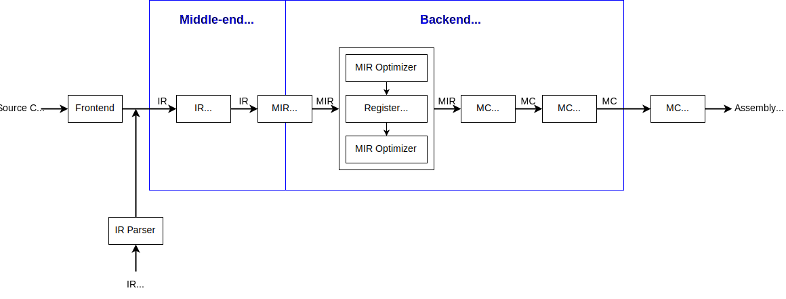

# mini-llvm

| main | develop |
|:-:|:-:|
| [](https://github.com/mini-llvm/mini-llvm/actions/workflows/build.yml?query=branch%3Amain) | [](https://github.com/mini-llvm/mini-llvm/actions/workflows/build.yml?query=branch%3Adevelop) |

## Design



## Supported IR Features

### Types

- `void`
- Integer types
  - `i1`
  - `i8`
  - `i16`
  - `i32`
  - `i64`
- Floating-point types
  - `float`
  - `double`
- `ptr`
- Array types
- Function types
- `label`

### Constants

- Integer constants
- Floating-point constants
- `null`
- Array constants
- `poison`

### Instructions

- Terminators
  - `br`
  - `ret`
- Binary operators
  - Integer
    - Arithmetic
      - `add`
      - `sub`
      - `mul`
      - `sdiv`
      - `udiv`
      - `srem`
      - `urem`
      - `and`
      - `or`
      - `xor`
      - `shl`
      - `lshr`
      - `ashr`
    - Relational
      - `icmp`
  - Floating-point
    - Arithmetic
      - `fadd`
      - `fsub`
      - `fmul`
      - `fdiv`
      - `frem`
    - Relational
      - `fcmp`
- Unary operators
  - `fneg`
- Casting operators
  - Integer
    - `trunc`
    - `sext`
    - `zext`
  - Floating-point
    - `fptrunc`
    - `fpext`
  - Integer to floating-point
    - `sitofp`
    - `uitofp`
  - Floating-point to integer
    - `fptosi`
    - `fptoui`
  - `bitcast`
- Memory management
  - `alloca`
  - `load`
  - `store`
- `getelemenetptr`
- `select`
- `call`
- `phi`

## Supported Targets

- RISC-V
  - `riscv64`

## Supported Optimizations (Work in Progress)

### IR

- `AlgebraicSimplification`
- `BasicBlockMerging`
- `BranchSimplification`
- `ConstantFolding`
- `DeadCodeElimination`
- `FunctionInlining`
- `JumpThreading`
- `Mem2Reg`
- `PoisonFreeze`
- `PoisonPropagation`
- `UnreachableBlockElimination`

### MIR

- `ConstantPropagation`
- `ConstantReuse`
- `DeadCodeElimination`
- `IdentityMoveElimination`
- `ZeroRegisterReplacement`

### MC

- `RedundantLabelElimination`
- RISC-V
  - `RISCVFallthrough`

## Supported Register Allocators (Work in Progress)

- `NaiveAllocator`
- `LinearScanAllocator`

## Usage

<table>
<tr>
<td>example.ll</td>
</tr>
<tr>
<td>

```llvm
define i32 @add(i32 %0, i32 %1) {
2:
  %3 = add i32 %0, %1
  ret i32 %3
}
```

</td>
</tr>
</table>

```sh
mini-llc --target=riscv64 -o example.s example.ll
```

## Building

| Linux | macOS | Windows |
|:-:|:-:|:-:|
| ✓ | ✗ | ✗ |

| GCC | Clang |
|:-:|:-:|
| ≥ 14 | ≥ 18 |

| CMake |
|:-:|
| ≥ 3.20 |

```sh
git clone --depth=1 --recurse-submodules --shallow-submodules <repo-url>
```

```sh
sudo apt-get update
sudo apt-get -y install g++-14 cmake ninja-build
cd <repo-dir>
mkdir build && cd build
cmake -DCMAKE_CXX_COMPILER=g++-14 -DCMAKE_BUILD_TYPE=Release -DMINI_LLVM_TESTS=ON -G Ninja ..
cmake --build .
./tools/mini-llc/mini-llc --help
```
## Running Tests

### Unit Tests

```sh
cd <repo-dir>/build
ctest .
```

### Integration Tests

```sh
sudo apt-get update
sudo apt-get -y install gcc-14-riscv64-linux-gnu qemu-user
sudo mkdir -p /usr/gnemul
sudo ln -s /usr/riscv64-linux-gnu /usr/gnemul/qemu-riscv64
cd <repo-dir>/tests/tools/mini-llc
export TARGET="riscv64"
export MINI_LLC_COMMAND="../../../build/tools/mini-llc/mini-llc"
export GCC_COMMAND="riscv64-linux-gnu-gcc-14"
export QEMU_COMMAND="qemu-riscv64"
export DIFF_COMMAND="diff"
export MINI_LLC_TIMEOUT="10"
export QEMU_TIMEOUT="10"
xargs ./test.sh < tests.txt
```

## License

mini-llvm is licensed under the [MIT license](https://opensource.org/licenses/MIT).
